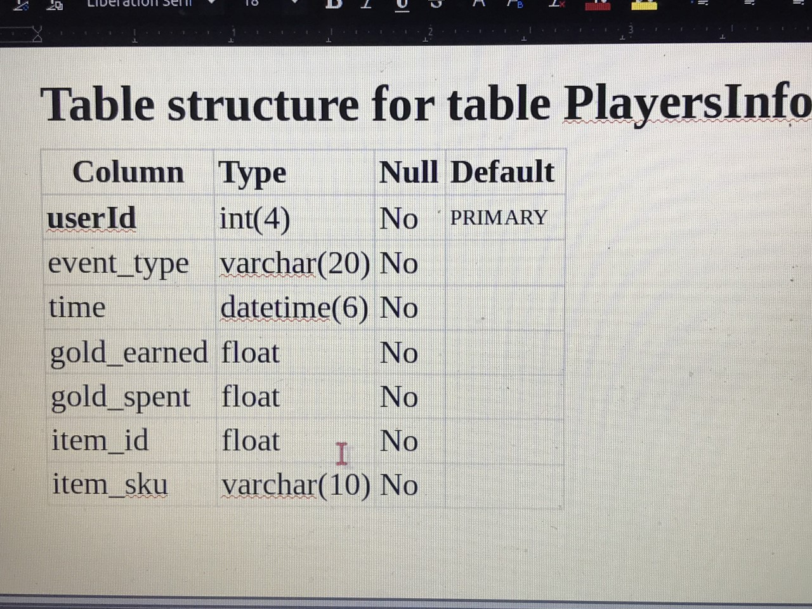

# GAME DATABASE
### This was a TakeHome Assignment from a Company for a Data Engineer Role

##### First
I had to Parse through a Huge JSON file that was Malformed with Errors

##### Second
I used python to log all the Malformations and Errors, then remove them.

##### Third 
I used Pandas to Visiualize and transfer to CSV file for the tables I wanted to use for the mySQL Schemas

